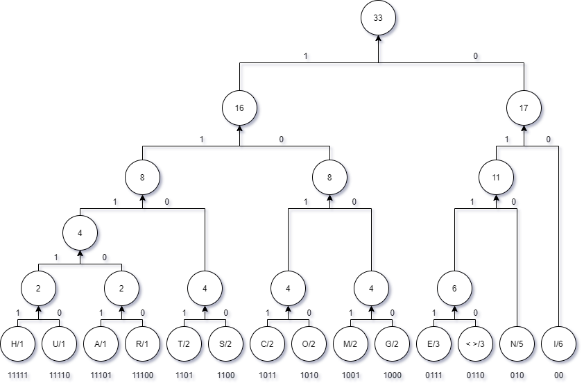

# Compression of Text using Huffman Coding
This implementation has two seperate C programs. One will input a text file and will output a compressed version of the text file into two separate files. One is the **.huffman** file which has the content. The other file is **.table** file where it contains the huffman lookup table. The other program is used for decompression. This program inputs the above generated two **.huffman** file and **.table** file and will output a **.txt** file.

This method of coding was introduced by David A. Huffman  In 1951. while he was a Ph.D. student at MIT. He was given the task to find an efficient way of coding and came up with the idea of using a **frequency-sorted binary tree** and proved this method to be the most efficient. He published a paper in 1952 titled "[A Method for the Construction of Minimum Redundancy Codes](http://compression.ru/download/articles/huff/huffman_1952_minimum-redundancy-codes.pdf)".

## Data Compression
In communication; data compression is source coding where reduction of bits used is done. The overall aim is to use fewer bits to encode the data than the original number of bits. This coding is usually done at the source of the data before it is transmitted.
Consider five symbols A, B, C, D and E to be transmitted which has a probability of occurring 0.5, 0.2, 0.1, 0.1, and 0.1 respectively. Since there are 5 symbols or letters, we have to use at least three(3) bits to represent one symbol. But if we use the Huffman coding method this can be reduced as follows.

- A – 000 can be represented as A – 0                                               
- B – 001 can be represented as B - 10 
- C - 010 can be represented as C - 010 
- D - 011 can be represented as D - 011
- E - 100 can be represented as E - 100 

Thus reducing the overall number of bits required to represent the text. Most Frequently occurring symbols with a low number of bits and least frequently occurring symbols with a higher number of bits.

### Lossless or Lossy Compression
The result of data compression can be either lossy or lossless. If the compression is lossy there will be a reduction in the bits where some of the unnecessary data will be removed and only an approximation of the original data will be recovered after decoding. Such as video and image compression algorithms.
On the other hand, no information will be lost in the lossless data compression. The process of reducing the size of a data file is referred to as data compression. Lossless data compression is used in many applications. For example, it is used in the ZIP file.

## Huffman Tree and Coding using Huffman
Huffman tree is a technique that is used to generate codes that are distinct to each other. Using this method, most occurring symbols will get the least number of bits and others accordingly.
1. Sort all the different symbols and their particular frequency or probability. 
2. Take the two lowest probability symbol and create a new common node with the probability equal to the sum of the two probability. Always make sure to add the lowest summing up nodes. 
3. Add the new node to the table instead of the lowest two symbols or nodes. 
4. Repeat step two and three until one symbol or node is remaining. 
5. Then allocate ‘0’ to all the right branches and ‘1’ to all right branches
6. Read the bits from top of the tree to the bottom to each symbol and record their particular bit pattern 

### A Practical Example
Consider the following sentence.

**THIS IS COMMUNICATION ENGINEERING**

The following table represents the letters and their occurances in the above sentence.
|letter|no of occurences|letter|no of occurences|
|------|----------------|------|----------------|
|T     |2               |c     |2               |
|h     |1               |m     |2               |
|i     |6               |u     |1               |
|s     |2               |a     |1               |
|space |3               |g     |2               |
|e     |3               |r     |1               |
|o     |2               |n     |5               |

For the above table, consider the following huffman tree. Arrange all the letters in ascending order in their frequency of their occurance.


## How to Run the code
Compile both of the programs called huffman_encode.c and huffman_decode.c using GCC. 
```
gcc -o huffman_encode huffman_encode.c
gcc -o huffman_decode huffman_decode.c
```
After Compiling use the **huffman_encode** binary to encode or compress any given text file in **.txt** format. For example, if you input **abc.txt** file, this will output two separate files in the same directory with **abc.huffman** and **abc.table** extensions.
```
huffman_encode abc.txt
```
Use the **huffman_decode** binary to decode or decompress any **.huffman** and **.table** file. These two files are mandatory. The decoded file will be saved in a directory with extension **.decoded**
```
huffman_decode abc.huffman
```

